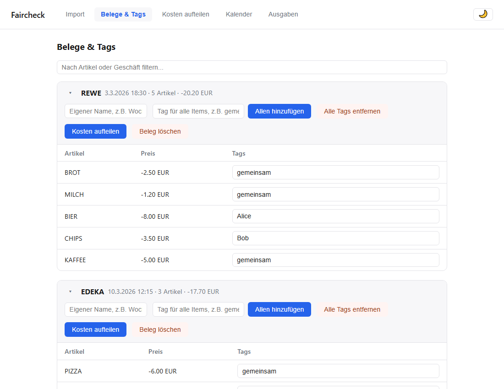
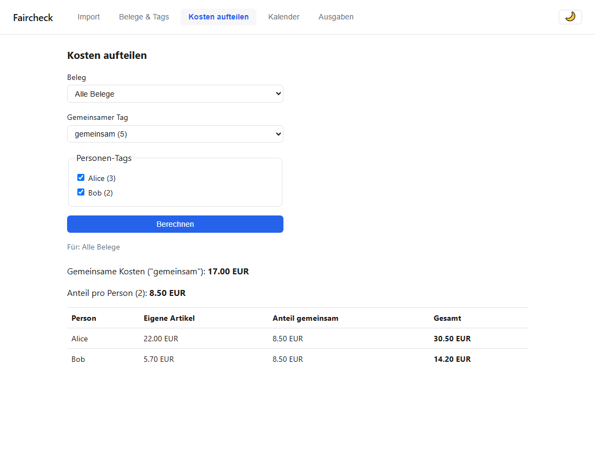
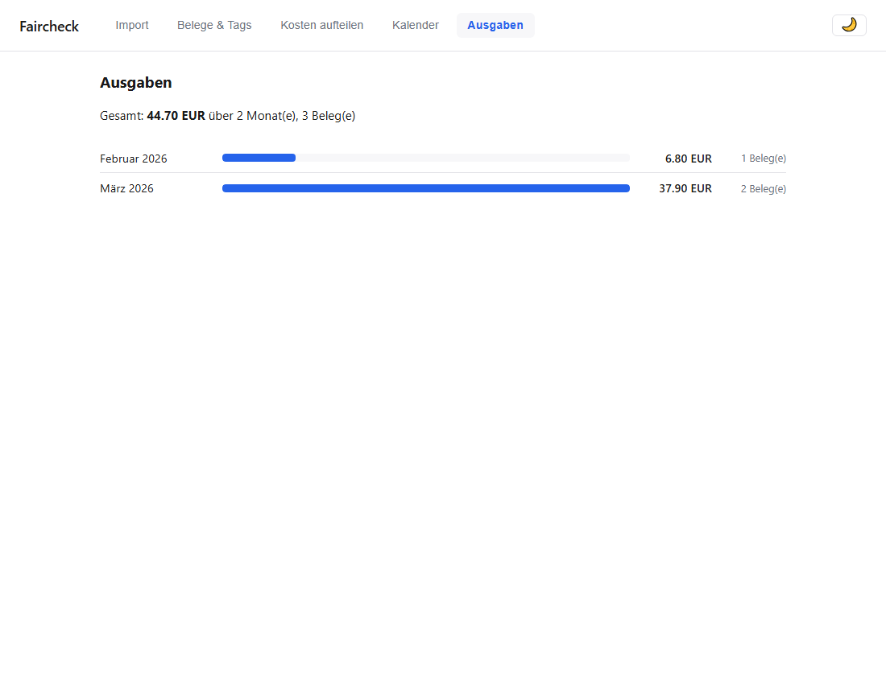

# Faircheck

Parses CSV receipt exports (from a receipt-scanning app), lets you tag individual line items, and splits costs between people — as both a CLI and a local web UI, sharing the same JSON file as storage.

*Not affiliated with or endorsed by epap.*








## Warum

Receipt-scanning apps that export a full purchase history as CSV tend to encode each receipt's line items as a single pipe-delimited string (`Name|Kategorie|Preis|...`) rather than proper rows — fine for the app itself, painful to work with by hand. This project parses that format into a clean data model, then adds what the export doesn't provide: tagging items (e.g. "shared", "person A"), and splitting the resulting costs between people.

## Features

- **CSV import**, merged by receipt ID — re-importing a full export (which always contains the entire history) adds new receipts without touching or duplicating existing ones, and preserves tags already assigned
- **Tagging**: per item, bulk per receipt, or cleared per receipt — with a free-text label per receipt (useful when two receipts from the same store land on the same day)
- **Cost splitting**: pick a "shared" tag and one tag per person, get an even split of shared costs plus each person's individually-tagged items — scoped to a single receipt or aggregated across all of them
- **Calendar view**: which days had purchases, click through to the receipt
- **Spending overview**: totals per month
- **CLI and local web UI**, both operating on the same JSON store — use whichever fits, switch anytime
- **MCP server** ([Model Context Protocol](https://modelcontextprotocol.io/)): exposes receipts, spending, tags, and cost-splitting as tools that any MCP-compatible AI assistant (Claude Desktop, Claude Code, …) can call — same core library, no duplication

## Tech stack

- TypeScript (Node.js), strict mode
- [Express](https://expressjs.com/) for the web server
- [@inquirer/prompts](https://github.com/SBoudrias/Inquirer.js) for the interactive CLI
- [csv-parse](https://csv.js.org/parse/) for CSV parsing
- Plain HTML/CSS/JS frontend — no framework, no build step
- [tsx](https://github.com/privatenumber/tsx) to run TypeScript directly
- [@modelcontextprotocol/sdk](https://github.com/modelcontextprotocol/typescript-sdk) for the MCP server

## Getting started

```bash
npm install

# Import a CSV export
npm run cli -- import path/to/export.csv

# Interactive CLI
npm run cli -- tag
npm run cli -- split

# Local web UI (http://localhost:3000)
npm run web

# MCP server (for Claude Desktop, Claude Code, etc.)
npm run mcp

# Tests
npm test
```

### MCP server

The MCP server exposes Faircheck's core library as tools that an AI assistant can call directly — no separate API, no duplication of logic.

**Tools:** `list_receipts`, `get_receipt`, `get_spending`, `split_costs`, `list_tags` (all read-only).
**Resources:** `faircheck://receipts/summary` — a compact overview of the data store.

To use it with Claude Desktop, add this to your `claude_desktop_config.json`:

```json
{
  "mcpServers": {
    "faircheck": {
      "command": "npx",
      "args": ["tsx", "src/mcp/index.ts"],
      "cwd": "/path/to/faircheck"
    }
  }
}
```

Then ask Claude things like *"Was habe ich im Juli ausgegeben?"* or *"Teile die Kosten zwischen Alice und Bob auf."*

All commands accept an optional store path as an argument (defaults to `data/receipts.json`), so you can keep separate stores if you want.

## Architecture

The core logic (`src/`: CSV parsing, tagging, cost-splitting, JSON storage) is a plain TypeScript library with no dependency on any interface. The CLI (`src/cli/`), the web server (`src/web/`), and the MCP server (`src/mcp/`) are all thin layers on top of it, reading the same JSON file — so features only need to be built once at the library level and then wired into whichever interface makes sense.

## License

MIT — see [LICENSE](LICENSE).
